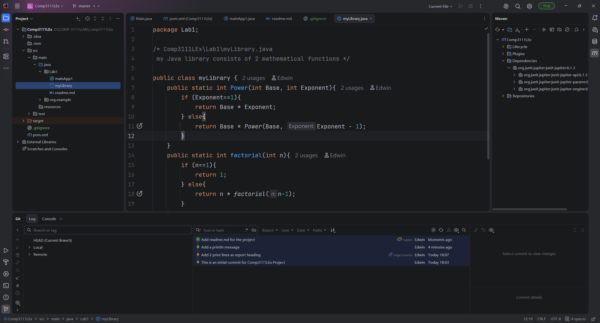

# COMP3111 Lab1

Name: Wang Tak Kwan  
SID: 21150121

## Remarks

This is the COMP3111 Lab1 project.

The project contains:
- `myLibrary.java`: provides `power` and `factorial`
- `mainApp1.java`: main application

## IntelliJ Screenshot

The screenshot below shows the Project tool window, Java editor, and Git Log with at least 3 commits.

